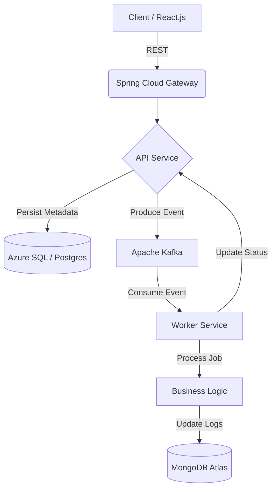

---

# 🚀 LuminaTask: Distributed High-Throughput Task Orchestrator

**LuminaTask** is a cloud-native, event-driven orchestration engine designed to handle long-running asynchronous jobs with high reliability and observability.

In a world where user experience is non-negotiable, LuminaTask ensures that heavy data processing, report generation, and system integrations happen "behind the curtain," providing users with instant feedback while the heavy lifting occurs in a resilient, distributed backend.

---

## 🧠 The "AI-Native" Engineering Philosophy

This project wasn't just coded; it was **architected with AI-assistance**. I utilized LLMs to:

* **Simulate Edge Cases:** Generated complex failure scenarios to test the system’s resilience.
* **Optimize Queries:** Refined MongoDB aggregation pipelines for high-velocity logging.
* **Architecture Review:** Used AI as a "Rubber Duck" to validate the decoupling of the Producer-Consumer pattern.

---

## 🏗️ Architecture & System Design

LuminaTask follows a **Microservices Architecture** leveraging the **Saga Pattern** for distributed consistency.

### Key Components:

* **API Gateway:** Centralized entry point handling rate-limiting and authentication.
* **Event Backbone (Kafka):** Ensures at-least-once delivery semantics and acts as a buffer during traffic spikes.
* **Polyglot Persistence:** * **PostgreSQL:** Stores job state and relational metadata (ACID compliant).
* **MongoDB:** Stores high-volume, unstructured execution logs and "stack traces" for failed jobs.

* **Worker Nodes:** Horizontally scalable consumers built with **Java 21 Virtual Threads** (Project Loom) for massive concurrency.

---

## 🛠️ Tech Stack

| Category | Technology |
| --- | --- |
| **Runtime** | Java 21 (LTS), Spring Boot 3.4+ |
| **Communication** | Apache Kafka, REST, WebSockets |
| **Cloud/Infra** | Docker, Azure Kubernetes Service (AKS), Azure Pipelines |
| **Observability** | Prometheus, Grafana, Micrometer (Tracing) |
| **Databases** | MongoDB Atlas, Azure SQL |

---

## 🌟 High-Value Features

* **Dynamic Worker Scaling:** Spin up specialized workers for different task types (e.g., `PDF_GEN` vs `DATA_SYNC`).
* **Resiliency Patterns:** Implemented Retries with Exponential Backoff and Dead Letter Queues (DLQ) for failed tasks.
* **Real-Time Progress:** Low-latency status updates via WebSocket integration.
* **Distributed Tracing:** Every task is assigned a Correlation ID, allowing for full end-to-end visibility across services.

---

## 📈 Value Creation Tracker

I utilize **Agile methodologies** to ensure continuous value delivery:

* **Sprint Planning:** Managed via GitHub Projects/Zenhub.
* **Automated CI/CD:** Every push triggers an Azure Pipeline for automated testing and container scanning.
* **TDD:** 80%+ Code coverage with JUnit 5 and Mockito.

---

## 🚦 Getting Started

1. **Clone:** `git clone https://github.com/[YourUsername]/lumina-task.git`
2. **Environment:** Ensure Docker Desktop is running.
3. **Up:** `docker-compose up -d` (Launches Kafka, Mongo, and Postgres).
4. **Build:** `./mvnw clean install`

---

### Why this project for my next role?

This project demonstrates my transition from maintenance-focused roles to **Distributed Systems Design**. It highlights my ability to migrate legacy mindsets into modern, scalable, and event-driven architectures.

---
