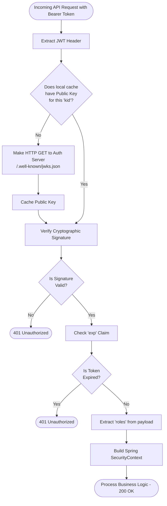
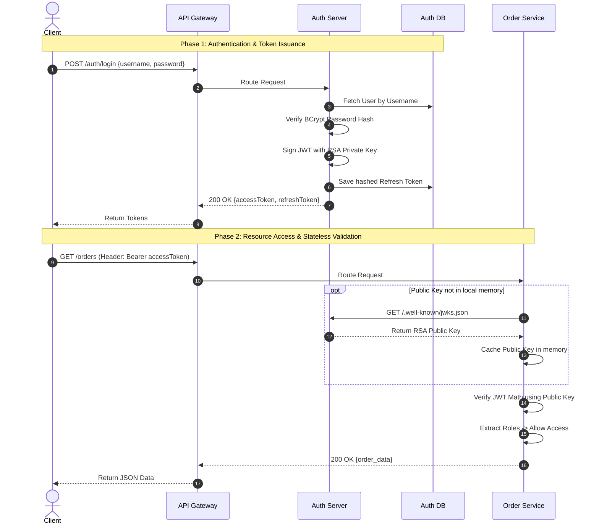
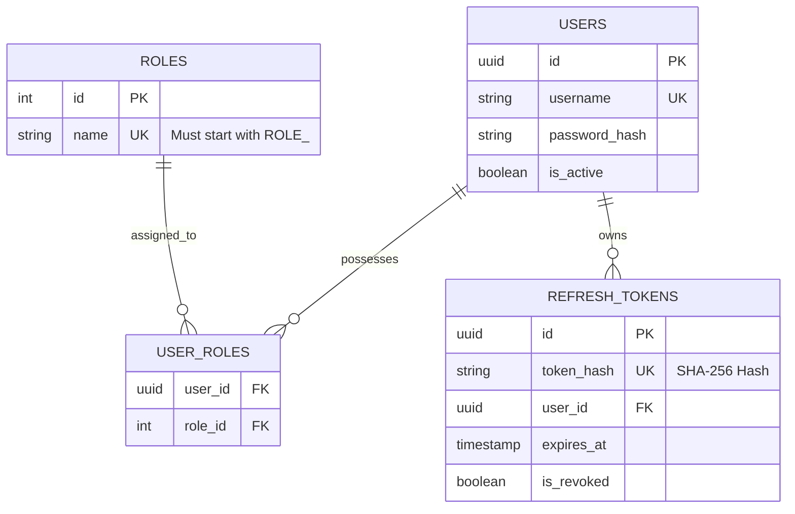

---

# Architecture Design Document: Centralized Asymmetric JWT Auth Server

**Developer Note:** Welcome to the Auth Server project! This document outlines exactly how our authentication system works. We are building a **stateless, asymmetric JWT** architecture. This means the Auth Server is the only application that can *create* tokens (using a Private Key), while downstream microservices can only *verify* them (using a Public Key).

If you have any questions while reading this, look at the diagrams first—they map out the exact data flow.

---

## 1. High-Level Design (HLD)

The HLD defines the boundaries of our system. Notice that the Auth Server has its own private database. **No other microservice is allowed to connect to the Auth Database.**

### 1.1 System Component Diagram

This diagram shows the physical pieces of our architecture and how they connect.

```mermaid
flowchart TB
    Client([Client App / Web / Mobile])
    Gateway[API Gateway]
    
    subgraph Secure Issuing Zone
        AuthServer[Auth Server \n Spring Boot]
        AuthDB[(Auth DB \n PostgreSQL/MySQL)]
    end
    
    subgraph Resource Zone (Downstream)
        OrderSvc[Order Service \n Spring Boot]
        ProductSvc[Product Service \n Spring Boot]
    end

    Client -->|All Traffic| Gateway
    
    Gateway -->|1. /auth/* endpoints| AuthServer
    Gateway -->|2. /api/orders/* | OrderSvc
    Gateway -->|3. /api/products/*| ProductSvc
    
    AuthServer -->|Reads/Writes Users & Tokens| AuthDB
    
    OrderSvc -.->|Async HTTP GET\nFetch Public Key| AuthServer
    ProductSvc -.->|Async HTTP GET\nFetch Public Key| AuthServer

    classDef secure fill:#f9d0c4,stroke:#333,stroke-width:2px;
    class AuthServer,AuthDB secure;

```

### 1.2 The Two-Token System (Access + Refresh)

We use a split-token pattern to balance speed and security:

* **Access Token (Short-Lived - 15 mins):** A JWT used to access APIs. It is stateless. Once issued, downstream services validate it locally without asking the database.
* **Refresh Token (Long-Lived - 7 days):** A random secure string stored in the database. When the Access Token expires, the client sends this to the Auth Server to get a new Access Token. If we need to ban a user, we revoke this token in the database.

---

## 2. Low-Level Design (LLD)

This section contains the exact implementation details you need to write the code.

### 2.1 Logic Flow Diagram (Token Validation)

When a downstream service (like Order Service) receives a request with an Access Token, it follows this exact logical flow to validate it. Spring Security handles most of this automatically via the `oauth2ResourceServer` module.



### 2.2 System Sequence Diagram

This sequence diagram maps the exact chronological steps of a user logging in and subsequently requesting data from a downstream microservice. Use this to trace your API calls.



---

## 3. Data layer Specifications

### 3.1 Entity Relationship (ER) Diagram

These are the tables you will create using Spring Data JPA in the Auth Server.



**Implementation Rules for the Database:**

* **Passwords:** Must be hashed using `BCryptPasswordEncoder`. Never store plain text.
* **Refresh Tokens:** We store the *hash* of the refresh token (using `SHA-256`), not the actual token. If the database is compromised, the attacker cannot use the hashes to generate access tokens.

---

## 4. API & Data Contracts

### 4.1 Required Endpoints (Auth Server)

You will need to implement these Spring `@RestController` endpoints:

| Endpoint | Method | Auth Required | Payload / Action |
| --- | --- | --- | --- |
| `/.well-known/jwks.json` | `GET` | **No** | Returns the RSA Public Key. Used by downstream services. |
| `/auth/login` | `POST` | **No** | **Req:** `{ "username": "...", "password": "..." }`<br>

<br>**Res:** `{ "accessToken": "...", "refreshToken": "..." }` |
| `/auth/refresh` | `POST` | **No** | **Req:** `{ "refreshToken": "..." }`<br>

<br>**Res:** `{ "accessToken": "...", "refreshToken": "..." }` |
| `/auth/logout` | `POST` | **Yes** | **Req:** `{ "refreshToken": "..." }`<br>

<br>**Action:** Sets `is_revoked = true` in DB. |

### 4.2 The JWT Payload Contract

When you configure the `JwtEncoder` in the Auth Server, the generated token payload **must** look exactly like this. Downstream services will crash if these fields are missing.

```json
{
  "iss": "https://auth.ourdomain.com",  // The issuer
  "sub": "user-uuid-1234-5678",         // The User ID (NEVER put PII like email here)
  "iat": 1716200000,                    // Issued At (Unix timestamp)
  "exp": 1716200900,                    // Expires At (Unix timestamp)
  "roles": ["ROLE_USER", "ROLE_ADMIN"]  // Custom array of granted authorities
}

```

**Developer Checklist before submitting PR:**

1. Did I configure `SecurityFilterChain` to allow unauthenticated access to `/auth/login` and `/.well-known/jwks.json`?
2. Did I use `Nimbus-JOSE-JWT` for token generation?
3. Are my refresh tokens expiring correctly in the database?

