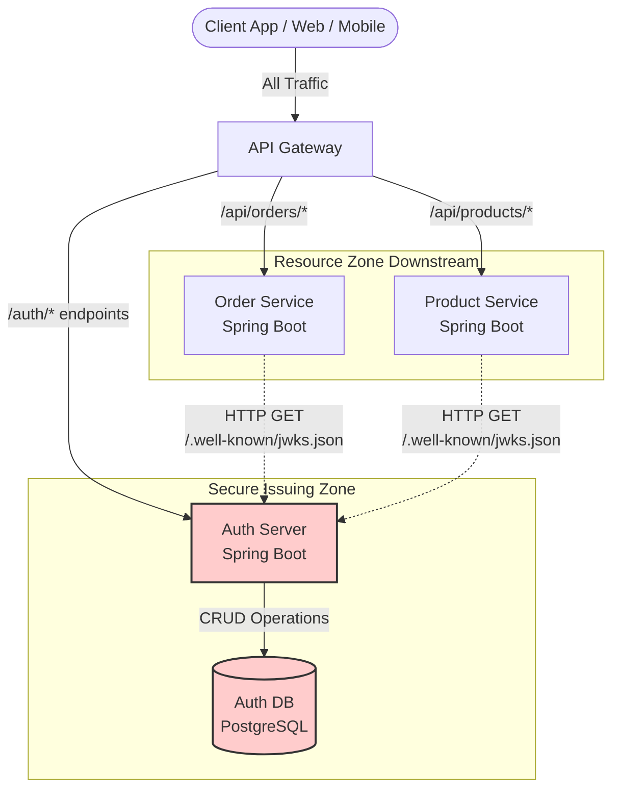
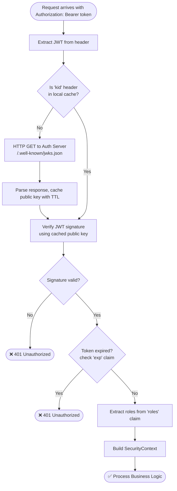
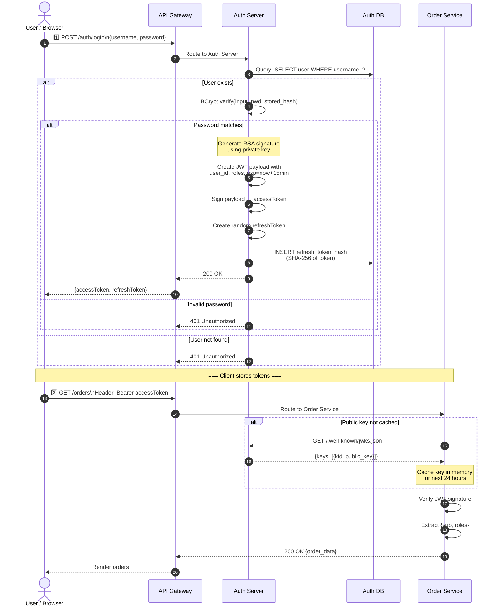
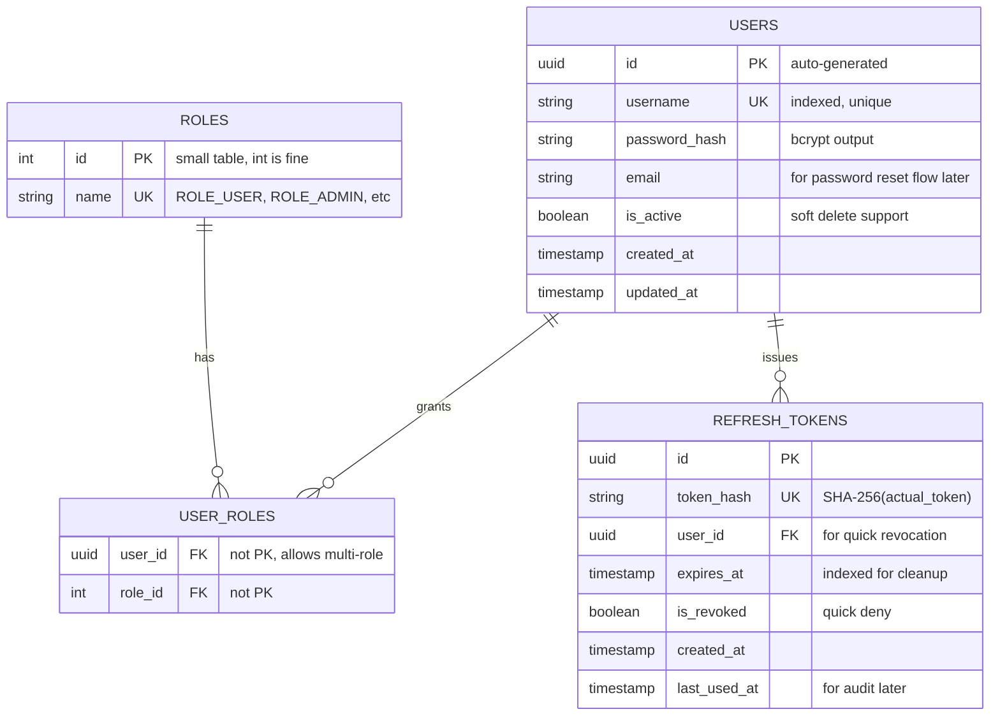

# Architecture Design Document: Centralized Asymmetric JWT Auth Server

**Last Updated:** May 2026  
**Status:** Production Implementation

---

## Context & Decisions

When we started scaling the microservices, we quickly realized that session-based auth wouldn't work. Each service would need access to a centralized session store, creating a bottleneck and a single point of failure. 

After reviewing options (OAuth2, custom session store, stateless JWT), we decided on **asymmetric JWT** for these reasons:

1. **Stateless validation** — downstream services verify tokens without querying Auth Server or a shared database
2. **Horizontal scalability** — no session affinity required; any service instance can validate any token
3. **Key rotation without client changes** — public key caching with optional refreshes means we can rotate keys without breaking clients
4. **Industry standard** — all our team members understand JWT; less custom code = fewer bugs

**Trade-off:** We accept slightly higher latency on first request (public key fetch) to gain resilience and scale.

---

## 1. System Architecture

### 1.1 Component Layout

This is how we physically deployed it:



**Why this layout?**
- Auth Server isolated in its own zone = no direct service-to-auth-db connections
- JWKS endpoint accessed async and cached = Auth Server isn't a hot spot
- API Gateway is single entry point = easier to add rate limiting, logging, TLS

### 1.2 Why Two Tokens (Access + Refresh)

Early iterations used a single long-lived token. We hit these issues:

1. **Token size explosion** — our refresh logic in Order Service was checking database on every 401. Performance tanked.
2. **Key rotation pain** — old tokens hung around for weeks; had to support multiple key versions in memory
3. **Security risk** — a single compromised token gave attackers a month of access

Solution: Split into two tokens:

| Token | Lifetime | Storage | Purpose | When Compromised |
|-------|----------|---------|---------|------------------|
| **Access Token** | 15 minutes | Client memory (volatile) | Stateless API requests | ~15 min max exposure |
| **Refresh Token** | 7 days | DB (hashed) + Client | Get new access token | Can be revoked immediately |

This forces an attacker to either:
- Act fast (15 min window) with access token only, OR
- Compromise the database to use refresh tokens

---

## 2. Implementation Details

### 2.1 Token Validation Flow in Downstream Services

When Order Service receives `GET /orders` with bearer token:



**Why we cache the public key:**
- Eliminates network latency for every request
- Auth Server under less load (huge reduction in JWKS GET requests)
- Cache miss only on server startup or key rotation

**Why we don't call the database:**
- Stateless = no database dependency = faster + more resilient
- If Auth Server is down, old tokens still work (downstream services only verify math)

### 2.2 Real Sequence: User Login → API Request

This is the actual flow a client follows:



**Key observations:**
- Login is expensive (bcrypt, DB query, JWT signing) but happens once
- Subsequent API calls are cheap (just JWT math + role check)
- Auth Server only called once per token lifetime (public key fetch)

---

## 3. Database Schema

### 3.1 Why This Structure

We designed the schema to prevent common auth bugs:



**Design decisions:**

1. **Password: Hashed with BCrypt** — never store plaintext
   - Cost factor: 10 (default) — ~100ms per hash
   - Slow = attacker needs GPU farm to brute force
   
2. **Refresh Token: Store HASH, not the token itself**
   - Client sends raw token → we compute SHA-256 → compare to stored hash
   - If DB is compromised, attacker gets useless hashes, not tokens
   - Similar to password security pattern

3. **USER_ROLES: Many-to-Many table**
   - One user can have multiple roles (ROLE_USER + ROLE_ADMIN)
   - Easy to add/remove roles without updating user row

4. **REFRESH_TOKENS: expires_at indexed**
   - We run a nightly job to delete expired tokens
   - Index makes cleanup query fast

---

## 4. API Contracts

### 4.1 Endpoints We Implement

| Endpoint | Method | Public? | Request | Response |
|----------|--------|---------|---------|----------|
| `/.well-known/jwks.json` | GET | ✅ Yes | None | `{ "keys": [{ "kid": "...", "kty": "RSA", "n": "...", "e": "..." }] }` |
| `/auth/login` | POST | ✅ Yes | `{ "username": "john", "password": "secret" }` | `{ "accessToken": "eyJ...", "refreshToken": "xyz..." }` |
| `/auth/refresh` | POST | ✅ Yes | `{ "refreshToken": "xyz..." }` | `{ "accessToken": "eyJ...", "refreshToken": "abc..." }` (optional new refresh token) |
| `/auth/logout` | POST | ❌ Auth Required | `{ "refreshToken": "xyz..." }` | `{ "message": "logged out" }` |
| `/auth/validate` | GET | ❌ Auth Required | None (uses Bearer token) | `{ "user_id": "...", "roles": ["..."], "exp": 1234567 }` |

**Why `/auth/validate`?**
- Added later when frontend needed to check if stored token is still valid
- Avoids forcing frontend to make invalid API calls to detect stale tokens

### 4.2 JWT Payload Format

Every JWT we issue looks exactly like this. Downstream services depend on these fields:

```json
{
  "iss": "https://auth.yourdomain.com",
  "sub": "550e8400-e29b-41d4-a716-446655440000",
  "iat": 1716200000,
  "exp": 1716203600,
  "roles": ["ROLE_USER"],
  "kid": "rsa-key-2026-05"
}
```

| Claim | Purpose | Set By | Used By |
|-------|---------|--------|---------|
| `iss` | Issuer identity | Auth Server config | Downstream (for validation) |
| `sub` | Subject = user UUID | Auth Server lookup | Downstream (for authorization logic) |
| `iat` | Issued at (Unix timestamp) | Auth Server | Security audits |
| `exp` | Expiration time | Auth Server (iat + 15 min) | Downstream (reject if expired) |
| `roles` | User's roles array | User DB lookup | Downstream (enforce @PreAuthorize) |
| `kid` | Key ID | RSA key metadata | Downstream (find right public key to verify) |

---

## 5. Implementation Checklist

Before merging to `main`, verify:

### Security
- [ ] Passwords hashed with `BCryptPasswordEncoder` (cost factor ≥ 10)
- [ ] Refresh token hash stored, not raw token
- [ ] Private key never exposed (only used in Auth Server)
- [ ] Public key endpoint returns JSON, not PEM (prevents accidental misuse)
- [ ] HTTPS enforced on all endpoints (even in dev, use self-signed cert)

### Functional
- [ ] `SecurityFilterChain` permits public access to `/auth/login`, `/auth/refresh`, `/.well-known/jwks.json`
- [ ] `SecurityFilterChain` requires auth for `/auth/logout`
- [ ] `JwtEncoder` configured with RSA private key
- [ ] `JwtDecoder` (for `/auth/validate`) configured with RSA public key
- [ ] Refresh token expiration checked in code (not just DB TTL)
- [ ] BCrypt password verification happens before token generation

### Testing
- [ ] Unit tests: BCrypt verify with correct/wrong password
- [ ] Unit tests: JWT signature verification with tampered payload
- [ ] Integration tests: Login → token generation → downstream validation
- [ ] Integration tests: Expired token rejected by downstream service
- [ ] Integration tests: Refresh token revocation blocks new access tokens

---

## 6. Common Pitfalls & How We Fixed Them

### Pitfall 1: Using `JwtEncoder` in downstream services
**What we did wrong:** Tried to decode JWTs without the library.
**How we fixed it:** Configured `JwtDecoder` using the public key, let Spring handle the heavy lifting.

### Pitfall 2: Storing raw refresh tokens in DB
**What we did wrong:** Stored them as plaintext; realized this mirrors the password security problem.
**How we fixed it:** Hash refresh tokens with SHA-256 before storing.

### Pitfall 3: Private key rotation broke downstream caches
**What we did wrong:** Generated new RSA keypair but didn't update `/.well-known/jwks.json`.
**How we fixed it:** Now we:
- Keep multiple key versions in JWKS response (current + previous)
- Cache with TTL so stale keys expire eventually
- Clients fall back to fetch JWKS if `kid` not found locally

### Pitfall 4: Forgot to index `expires_at` on REFRESH_TOKENS
**What we did wrong:** Cleanup query took 3+ seconds on 50K rows.
**How we fixed it:** Added index; now cleanup takes <100ms.

---

## 7. Future Improvements

These are on the backlog but not blocking launch:

- [ ] **Multi-region key sync** — replicate public keys to CDN
- [ ] **Audit logging** — log all login/logout/token refresh events
- [ ] **Device fingerprinting** — reject refresh tokens used from different IPs
- [ ] **Rate limiting** — per-username login attempts (prevent brute force)
- [ ] **Email verification** — send confirmation link before activating user
- [ ] **Password reset flow** — generate short-lived reset tokens

---

## Questions?

If something is unclear:
1. Check the sequence diagram (Section 2.2) for the happy path
2. Check the ER diagram (Section 3.1) for schema details
3. Check the API contracts (Section 4) for exact payloads

If still stuck, ask in `#backend-dev` on Slack.
